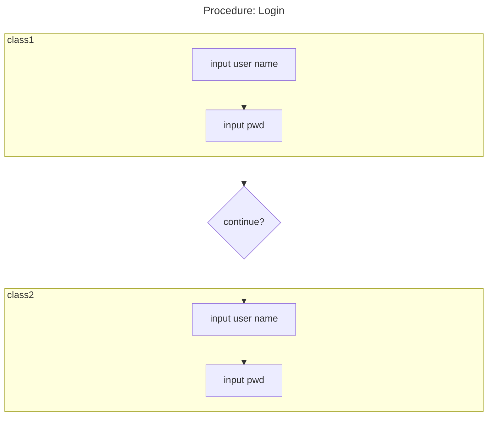

# Application.Service - Login

```mermaid

---
title: "Procedure: Login"
---

flowchart TB
    subgraph verification["<div style="width:50em; height:8em; display:flex; justify-content: flex-start; align-items:flex-start;">class1</div>"]
        direction TB
        step-1[input user name]
        step-2[input pwd]
    end

    q1{continue?}

    subgraph verification1["<div style="width:50em; height:8em; display:flex; justify-content: flex-start; align-items:flex-start;">class2</div>"]
        direction TB
        step-5[input user name]
        step-6[input pwd]
    end

    %%{relationship}%%
    step-1 --> step-2 --> q1 --> step-5 --> step-6

```
