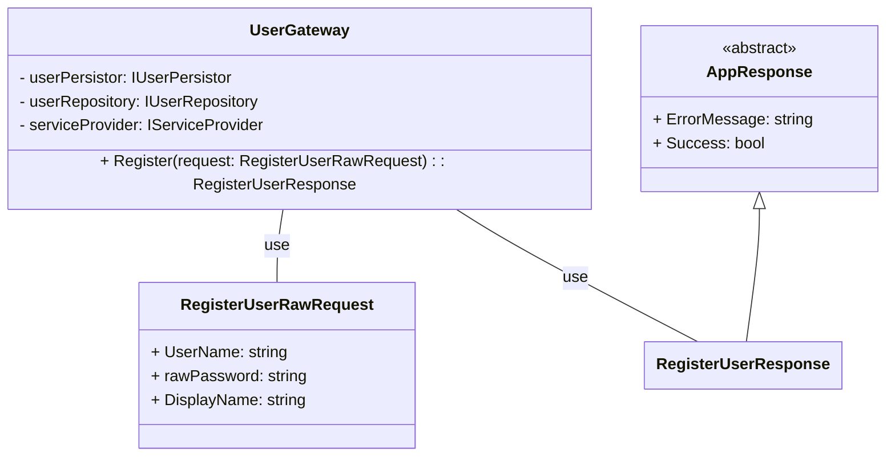

# Application.Gateway.User - UserGateway.Register

```mermaid
---
title: "Procedure: User Registartion Procedure"
---

flowchart TB
    start_overall((start))

    subgraph user_register[<div style='display:flex; justify-content:flex-start; align-items:flex-start;width:50em'>Application.Gateway.User.UserGateway.Register</div>]

        subgraph password_extraction_verification[<div style='display:flex; justify-content:flex-start; align-items:flex-start;width:48em'>PasswordHelper.ExtractPwdWithTimeVerification</div>]
            direction TB
            PwdExtraction[Password Extraction and Time Verfication]
        end

        subgraph insert_user_database[<div style='display:flex; justify-content:flex-start; align-items:flex-start;width:48em'>Application.Services.User.Commands.RegisterUserCommandHandler</div>]
            direction TB
            NewUser["New a ***User***"] -->
            AddNameIdentifier["Add a ***NameIdentifier*** ***Claim*** to the new ***User***"] -->
            InsertUser["`Insert ***User*** with Repository`"]
        end
    end

    end_overall(end)

    %%{relationship}%%
    start_overall --> PwdExtraction --> NewUser
    InsertUser --> 
    end_overall

    %% Custom Styles
    style user_register stroke-dasharray: 5 5;
    style password_extraction_verification stroke-dasharray: 5 5;
    style insert_user_database stroke-dasharray: 5 5;        
```

---

```mermaid
---
config:
    class:
        hideEmptyMembersBox: true
---

classDiagram
    %%{Class Definition}%%

    class UserGateway {
        - userPersistor: IUserPersistor
        - userRepository: IUserRepository
        - serviceProvider: IServiceProvider
        + Register(request: RegisterUserRawRequest): RegisterUserResponse
    }

    class AppResponse {
        <<abstract>>
        + ErrorMessage: string
        + Success: bool
    }

    class RegisterUserRawRequest { 
        + UserName: string
        + rawPassword: string
        + DisplayName: string
    }

    class RegisterUserResponse {

    }

    %%{Class Relationship}%%
    UserGateway --  RegisterUserRawRequest : use
    UserGateway --  RegisterUserResponse : use
    AppResponse <|-- RegisterUserResponse

```
