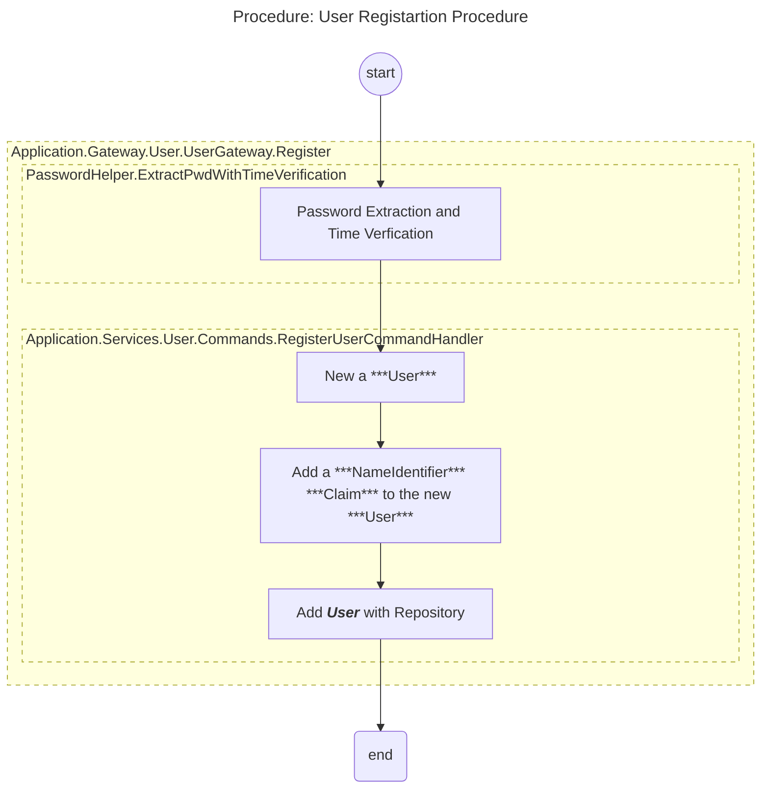
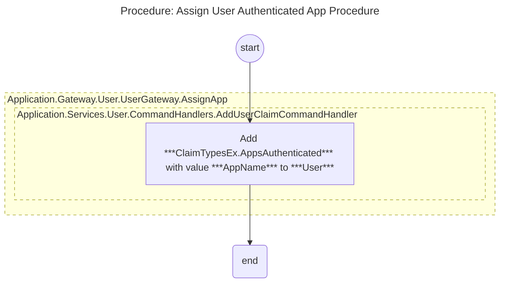
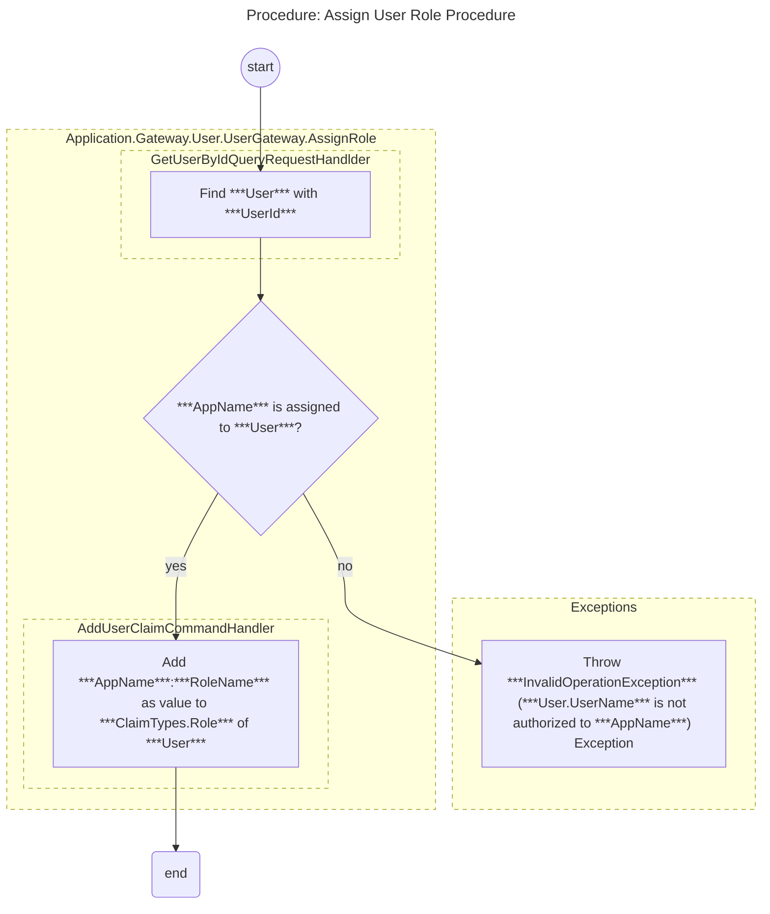
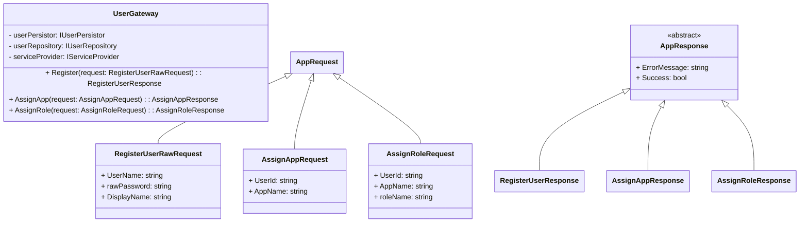

# Application.Gateway.User - UserGateway.Register

```mermaid
---
title: "Procedure: User Registartion Procedure"
---

flowchart TB
    start_overall((start))

    subgraph user_register[<div style='display:flex; justify-content:flex-start; align-items:flex-start;width:50em'>Application.Gateway.User.UserGateway.Register</div>]

        subgraph password_extraction_verification[<div style='display:flex; justify-content:flex-start; align-items:flex-start;width:48em'>PasswordHelper.ExtractPwdWithTimeVerification</div>]
            direction TB
            PwdExtraction[Password Extraction and Time Verfication]
        end

        subgraph insert_user_database[<div style='display:flex; justify-content:flex-start; align-items:flex-start;width:48em'>Application.Services.User.Commands.RegisterUserCommandHandler</div>]
            direction TB
            NewUser["New a ***User***"] -->
            AddNameIdentifier["Add a ***NameIdentifier*** ***Claim*** to the new ***User***"] -->
            InsertUser["`Add ***User*** with Repository`"]
        end
    end

    end_overall(end)

    %%{relationship}%%
    start_overall --> PwdExtraction --> NewUser
    InsertUser --> 
    end_overall

    %% Custom Styles
    style user_register stroke-dasharray: 5 5;
    style password_extraction_verification stroke-dasharray: 5 5;
    style insert_user_database stroke-dasharray: 5 5;        
```
---
# Application.Gateway.User - UserGateway.AssignApp

```mermaid
---
title: "Procedure: Assign User Authenticated App Procedure"
---

flowchart TB
    start_overall((start))

    subgraph maing[<div style='display:flex; justify-content:flex-start; align-items:flex-start;width:50em'>Application.Gateway.User.UserGateway.AssignApp</div>]

        subgraph subg1[<div style='display:flex; justify-content:flex-start; align-items:flex-start;width:48em'>Application.Services.User.CommandHandlers.AddUserClaimCommandHandler</div>]
            direction TB
            AddUserClaimCommandHandler[Add ***ClaimTypesEx.AppsAuthenticated*** with value ***AppName*** to ***User*** ]
        end
    end

    end_overall(end)

    %%{Note}%%
    
    %%{relationship}%%
    start_overall --> AddUserClaimCommandHandler --> 
    end_overall

    %% Custom Styles
    style maing stroke-dasharray: 5 5;
    style subg1 stroke-dasharray: 5 5;
```
---
# Application.Gateway.User - UserGateway.AssignRole

```mermaid
---
title: "Procedure: Assign User Role Procedure"
---

flowchart TB

    subgraph mainExceptions [Exceptions]
        direction TB
        InvalidOperationException1["Throw ***InvalidOperationException*** (***User.UserName*** is not authorized to ***AppName***) Exception"]
    end

    start_overall((start))

    subgraph maing[Application.Gateway.User.UserGateway.AssignRole]

        subgraph subg1[GetUserByIdQueryRequestHandlder]
            direction TB
            GetUserByIdQueryRequestHandlder[Find ***User*** with ***UserId*** ]
        end

        check1{***AppName*** is assigned to ***User***?}

        subgraph subg2[AddUserClaimCommandHandler]
            direction TB
            AddUserClaimCommandHandler[Add ***AppName***:***RoleName*** as value to ***ClaimTypes.Role*** of ***User*** ]
        end

    end

    end_overall(end)

    %%{Note}%%
    
    %%{relationship}%%
    start_overall --> GetUserByIdQueryRequestHandlder -->
    check1 --"no"--> InvalidOperationException1
    check1 --"yes"--> AddUserClaimCommandHandler -->
    end_overall

    %% Custom Styles
    style maing stroke-dasharray: 5 5;
    style subg1 stroke-dasharray: 5 5;
    style subg2 stroke-dasharray: 5 5;
    style mainExceptions stroke-dasharray: 5 5;
```
---

```mermaid
---
config:
    class:
        hideEmptyMembersBox: true
---

classDiagram
    %%{Class Definition}%%


    class UserGateway {
        - userPersistor: IUserPersistor
        - userRepository: IUserRepository
        - serviceProvider: IServiceProvider
        + Register(request: RegisterUserRawRequest): RegisterUserResponse
        + AssignApp(request: AssignAppRequest): AssignAppResponse
        + AssignRole(request: AssignRoleRequest): AssignRoleResponse
    }
    class AppRequest { }

    class AppResponse {
        <<abstract>>
        + ErrorMessage: string
        + Success: bool
    }

    class RegisterUserRawRequest { 
        + UserName: string
        + rawPassword: string
        + DisplayName: string
    }

    class AssignAppRequest { 
        + UserId: string
        + AppName: string
    }

    class AssignRoleRequest { 
        + UserId: string
        + AppName: string
        + roleName: string
    }

    class RegisterUserResponse {}

    class AssignAppResponse {}

    class AssignRoleResponse {}

    %%{Class Relationship}%%

    AppRequest <|-- RegisterUserRawRequest
    AppRequest <|-- AssignAppRequest
    AppRequest <|-- AssignRoleRequest

    AppResponse <|-- RegisterUserResponse
    AppResponse <|-- AssignAppResponse
    AppResponse <|-- AssignRoleResponse

```
