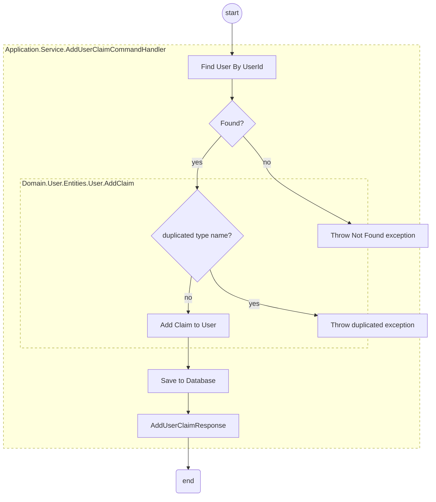
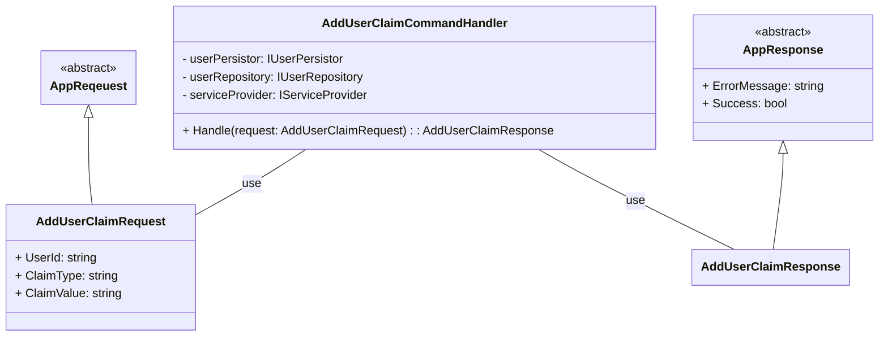

# Application.Service.AddUserClaimCommandHandler

```mermaid
flowchart TB
    
    start_overall((start))

    subgraph mainprocess [<div style='display:flex; justify-content:flex-start; align-items:flex-start;width:60em'>Application.Service.AddUserClaimCommandHandler</div>]
        direction TB

        FindUser[Find User By UserId] -->
        check1{Found?} 
        

        subgraph subprocess1 [<div style='display:flex; justify-content:flex-start; align-items:flex-start;width:50em'>Domain.User.Entities.User.AddClaim</div>]
            direction TB
            userFound{duplicated type name?}
            userFound --"no"-->       
            AddClaim["Add Claim to User"]    
        end

        updateDatabase[Save to Database] -->
        return[AddUserClaimResponse]
    end

    UserNotFound["Throw Not Found exception"]
    DuplicatedClaim["Throw duplicated exception"] 
    end_overall(end)    

    %%{Class Relationship}%%
    start_overall --> FindUser
    return --> end_overall
    check1 --"no"--> UserNotFound
    check1 --"yes"--> userFound
    userFound --"yes"--> DuplicatedClaim
    AddClaim --> updateDatabase

    %% Custom Styles
    style mainprocess stroke-dasharray: 5 5;
    style subprocess1 stroke-dasharray: 5 5;

```

---

```mermaid
---
config:
    class:
        hideEmptyMembersBox: true
---

classDiagram
    %%{Class Definition}%%

    class AppReqeuest {
        <<abstract>>
    }

    class AppResponse {
        <<abstract>>
        + ErrorMessage: string
        + Success: bool
    }

    class AddUserClaimCommandHandler {
        - userPersistor: IUserPersistor
        - userRepository: IUserRepository
        - serviceProvider: IServiceProvider
        + Handle(request: AddUserClaimRequest): AddUserClaimResponse
    }

    class AddUserClaimRequest { 
        + UserId: string
        + ClaimType: string
        + ClaimValue: string
    }

    class AddUserClaimResponse {
    }

    %%{Class Relationship}%%
    AddUserClaimCommandHandler --  AddUserClaimRequest : use
    AddUserClaimCommandHandler --  AddUserClaimResponse : use
    AppReqeuest <|-- AddUserClaimRequest
    AppResponse <|-- AddUserClaimResponse

```