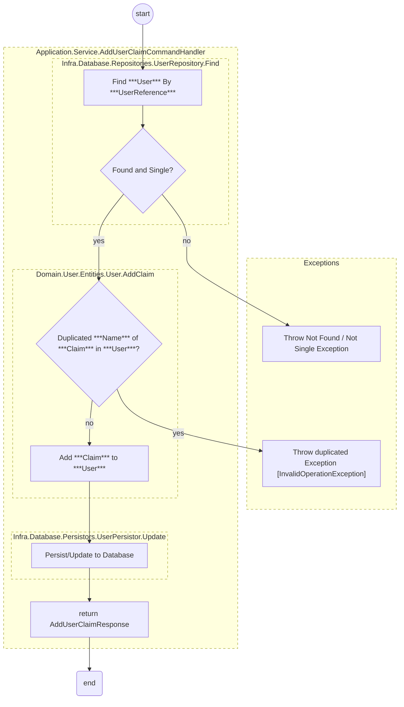
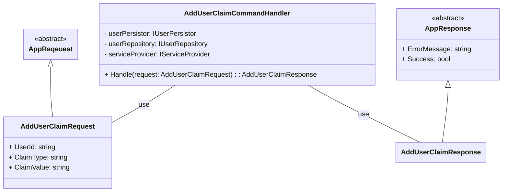

# Application.Service.AddUserClaimCommandHandler

```mermaid

flowchart TB 

    subgraph mainExceptions [<div style='display:flex; justify-content:flex-start; align-items:flex-start;'>Exceptions</div>]
        direction TB
        UserNotFound["Throw Not Found / Not Single Exception"] ~~~
        DuplicatedClaim["Throw duplicated Exception [InvalidOperationException]"] 
    end

    start_overall((start))

    subgraph mainprocess[Application.Service.AddUserClaimCommandHandler]
        direction TB            

        subgraph subprocess0 [Infra.Database.Repositories.UserRepository.Find]
            direction TB
            
            FindUser["Find ***User*** By ***UserReference***"] -->
            check1{Found and Single?} 
        end       

        subgraph subprocess1 [Domain.User.Entities.User.AddClaim]
            direction TB
            userFound{"Duplicated ***Name*** of ***Claim*** in ***User***?"}
            userFound --"no"-->       
            AddClaim["Add ***Claim*** to ***User***"]    
        end

        subgraph subprocess2 [Infra.Database.Persistors.UserPersistor.Update]
            direction TB
            updateDatabase["Persist/Update to Database"]
        end

        return["return AddUserClaimResponse"]
    end

    end_overall(end)    

    %%{Class Relationship}%%
    start_overall --> FindUser
    return --> end_overall
    check1 --"yes"--> userFound
    AddClaim --> updateDatabase
    updateDatabase --> return

    check1 --"no"--> UserNotFound
    userFound --"yes"--> DuplicatedClaim

    %% Custom Styles
    style mainprocess stroke-dasharray: 5 5;
    style mainExceptions stroke-dasharray: 5 5;
    style subprocess0 stroke-dasharray: 5 5;
    style subprocess1 stroke-dasharray: 5 5;
    style subprocess2 stroke-dasharray: 5 5;

```

---

```mermaid
---
config:
    class:
        hideEmptyMembersBox: true
---

classDiagram
    %%{Class Definition}%%

    class AppReqeuest {
        <<abstract>>
    }

    class AppResponse {
        <<abstract>>
        + ErrorMessage: string
        + Success: bool
    }

    class AddUserClaimCommandHandler {
        - userPersistor: IUserPersistor
        - userRepository: IUserRepository
        - serviceProvider: IServiceProvider
        + Handle(request: AddUserClaimRequest): AddUserClaimResponse
    }

    class AddUserClaimRequest { 
        + UserId: string
        + ClaimType: string
        + ClaimValue: string
    }

    class AddUserClaimResponse {
    }

    %%{Class Relationship}%%
    AddUserClaimCommandHandler --  AddUserClaimRequest : use
    AddUserClaimCommandHandler --  AddUserClaimResponse : use
    AppReqeuest <|-- AddUserClaimRequest
    AppResponse <|-- AddUserClaimResponse

```
