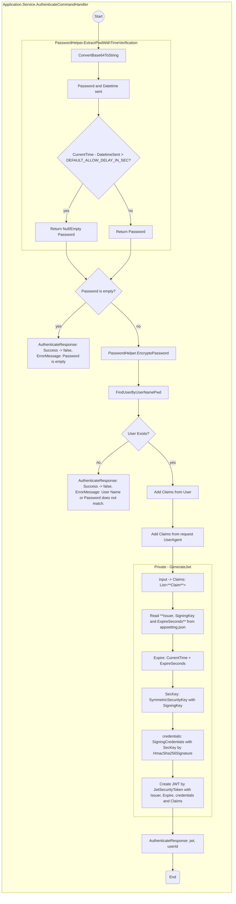
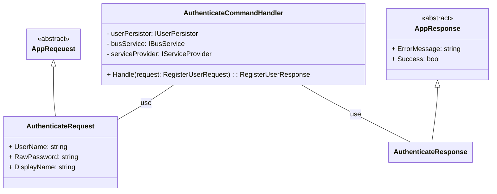

# Application.Service.AuthenticateCommandHandler

```mermaid
flowchart TB
    subgraph main [<div style='display:flex; justify-content:flex-start; align-items:flex-start;width:60em'>Application.Service.AuthenticateCommandHandler</div>]
        direction TB
        start((Start)) 

        subgraph ExtractPwdWithTimeVerification[PasswordHelper.ExtractPwdWithTimeVerification]
            direction TB
            ConvertBase64ToString -->
            pwdAndDatetime[Password and Datetime sent] -->
            checkWithinTimeLimit{CurrentTime - DatetimeSent > DEFAULT_ALLOW_DELAY_IN_SEC?} --"yes"-->
            returnNullPassword[Return Null/Empty Password]
            checkWithinTimeLimit --"no"-->
            returnPassword[Return Password]
        end
        
        check1{Password is empty?} --"yes"-->
        check1Y[AuthenticateResponse: Success -> false, ErrorMessage: Password is empty]
        check1 --"no"--> 
        EncryptoPassword[PasswordHelper.EncryptoPassword] -->
        FindUserByUserNamePwd[FindUserByUserNamePwd] -->
        check2{User Exists?} --"no"-->
        check2N[AuthenticateResponse: Success -> false, ErrorMessage: User Name or Password does not match.]
        check2 --"yes"-->
        AddClaim1[Add Claims from User] -->
        AddClaim2[Add Claims from request UserAgent]

        subgraph GenerateJwt[Private - GenerateJwt]
            direction TB
            GenerateJwtInput["input -> Claims: List<**Claim**>"] -->
            readConfig["Read **Issuer, SigningKey and ExpireSeconds** from appsetting.json"] -->
            expireDateTime[Expire: CurrentTime + ExpireSeconds] -->
            secKey[SecKey: SymmetricSecurityKey with SigningKey] -->
            credentials[credentials: SigningCredentials with SecKey by HmacSha256Signature] -->
            tokenDescriptor[Create JWT by JwtSecurityToken with Issuer, Expire, credentials and Claims]
        end

        return[AuthenticateResponse: jwt, userId] -->
        terminal(End)
    end

    %%{Class Relationship}%%
    start --> ConvertBase64ToString
    returnNullPassword --> check1
    returnPassword --> check1
    AddClaim2 --> GenerateJwtInput
    tokenDescriptor --> return


```

---

```mermaid
---
config:
    class:
        hideEmptyMembersBox: true
---

classDiagram
    %%{Class Definition}%%

    class AppReqeuest {
        <<abstract>>
    }

    class AppResponse {
        <<abstract>>
        + ErrorMessage: string
        + Success: bool
    }

    class AuthenticateCommandHandler {
        - userPersistor: IUserPersistor
        - busService: IBusService
        - serviceProvider: IServiceProvider
        + Handle(request: RegisterUserRequest): RegisterUserResponse
    }

    class AuthenticateRequest { 
        + UserName: string
        + RawPassword: string
        + DisplayName: string
    }

    class AuthenticateResponse {
    }

    %%{Class Relationship}%%
    AuthenticateCommandHandler --  AuthenticateRequest : use
    AuthenticateCommandHandler --  AuthenticateResponse : use
    AppReqeuest <|-- AuthenticateRequest
    AppResponse <|-- AuthenticateResponse

```