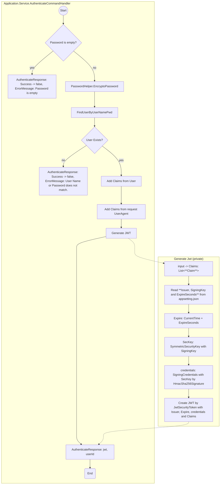
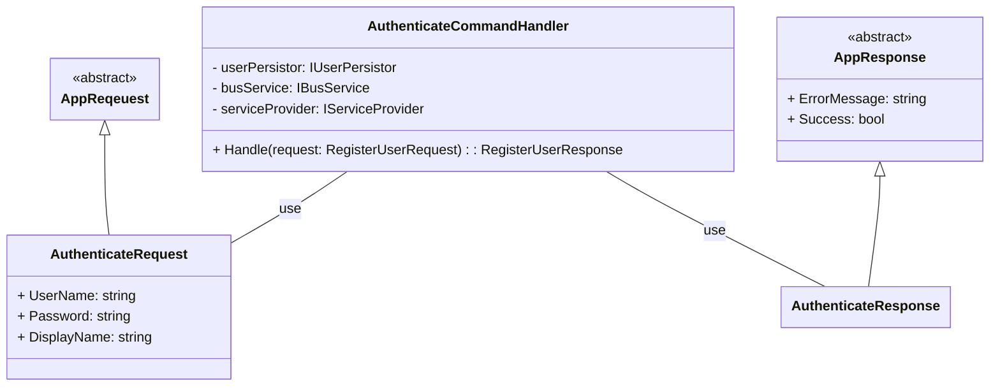

# Application.Service.AuthenticateCommandHandler

```mermaid
flowchart TB
    subgraph main [<div style='display:flex; justify-content:flex-start; align-items:flex-start;width:50em'>Application.Service.AuthenticateCommandHandler</div>]
        direction TB
        start((Start)) -->
        check1{Password is empty?} --"yes"-->
        check1Y[AuthenticateResponse: Success -> false, ErrorMessage: Password is empty]
        check1 --"no"--> 
        EncryptoPassword[PasswordHelper.EncryptoPassword] -->
        FindUserByUserNamePwd[FindUserByUserNamePwd] -->
        check2{User Exists?} --"no"-->
        check2N[AuthenticateResponse: Success -> false, ErrorMessage: User Name or Password does not match.]
        check2 --"yes"-->
        AddClaim1[Add Claims from User] -->
        AddClaim2[Add Claims from request UserAgent] -->
        GenerateJWTmain[Generate JWT] -->
        return[AuthenticateResponse: jwt, userId] -->
        terminal(End)
    end

    subgraph GenerateJwt["Generate Jwt (private)"]
        direction TB
        GenerateJwtInput["input -> Claims: List<**Claim**>"] -->
        readConfig["Read **Issuer, SigningKey and ExpireSeconds** from appsetting.json"] -->
        expireDateTime[Expire: CurrentTime + ExpireSeconds] -->
        secKey[SecKey: SymmetricSecurityKey with SigningKey] -->
        credentials[credentials: SigningCredentials with SecKey by HmacSha256Signature] -->
        tokenDescriptor[Create JWT by JwtSecurityToken with Issuer, Expire, credentials and Claims]
    end

    %%{Class Relationship}%%
    GenerateJWTmain -..-> GenerateJwtInput
    tokenDescriptor -..-> return


```

---

```mermaid
---
config:
    class:
        hideEmptyMembersBox: true
---

classDiagram
    %%{Class Definition}%%

    class AppReqeuest {
        <<abstract>>
    }

    class AppResponse {
        <<abstract>>
        + ErrorMessage: string
        + Success: bool
    }

    class AuthenticateCommandHandler {
        - userPersistor: IUserPersistor
        - busService: IBusService
        - serviceProvider: IServiceProvider
        + Handle(request: RegisterUserRequest): RegisterUserResponse
    }

    class AuthenticateRequest { 
        + UserName: string
        + Password: string
        + DisplayName: string
    }

    class AuthenticateResponse {
    }

    %%{Class Relationship}%%
    AuthenticateCommandHandler --  AuthenticateRequest : use
    AuthenticateCommandHandler --  AuthenticateResponse : use
    AppReqeuest <|-- AuthenticateRequest
    AppResponse <|-- AuthenticateResponse

```