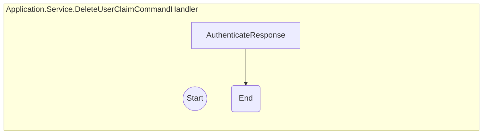
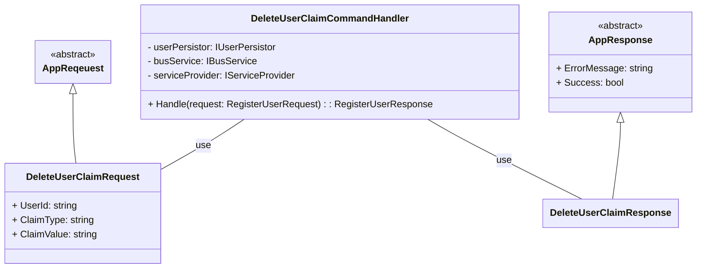

# Application.Service.DeleteUserClaimCommandHandler

```mermaid
flowchart TB
    subgraph main [<div style='display:flex; justify-content:flex-start; align-items:flex-start;width:60em'>Application.Service.DeleteUserClaimCommandHandler</div>]
        direction TB
        start((Start)) 


        return[AuthenticateResponse] -->
        terminal(End)
    end

    %%{Class Relationship}%%


```

---

```mermaid
---
config:
    class:
        hideEmptyMembersBox: true
---

classDiagram
    %%{Class Definition}%%

    class AppReqeuest {
        <<abstract>>
    }

    class AppResponse {
        <<abstract>>
        + ErrorMessage: string
        + Success: bool
    }

    class DeleteUserClaimCommandHandler {
        - userPersistor: IUserPersistor
        - busService: IBusService
        - serviceProvider: IServiceProvider
        + Handle(request: RegisterUserRequest): RegisterUserResponse
    }

    class DeleteUserClaimRequest { 
        + UserId: string
        + ClaimType: string
        + ClaimValue: string
    }

    class DeleteUserClaimResponse {
    }

    %%{Class Relationship}%%
    DeleteUserClaimCommandHandler --  DeleteUserClaimRequest : use
    DeleteUserClaimCommandHandler --  DeleteUserClaimResponse : use
    AppReqeuest <|-- DeleteUserClaimRequest
    AppResponse <|-- DeleteUserClaimResponse

```