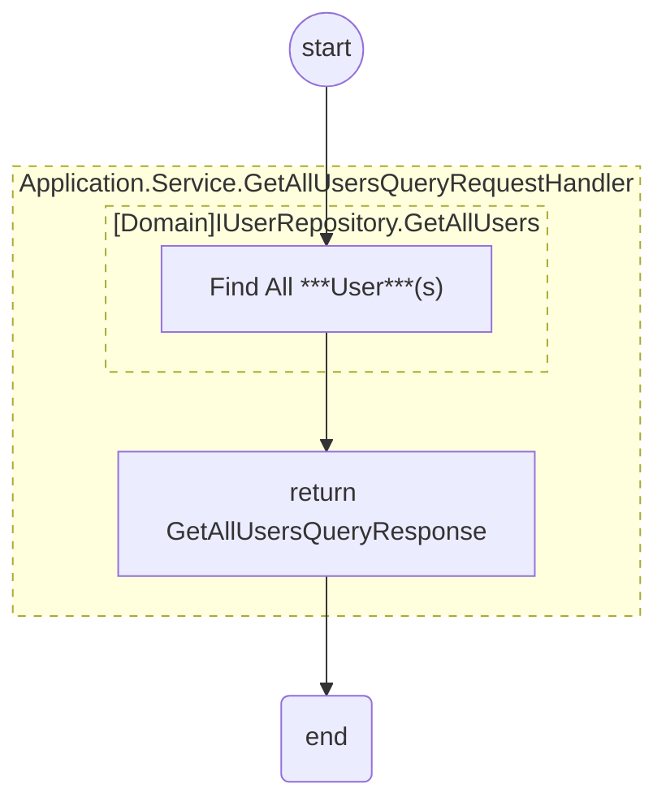
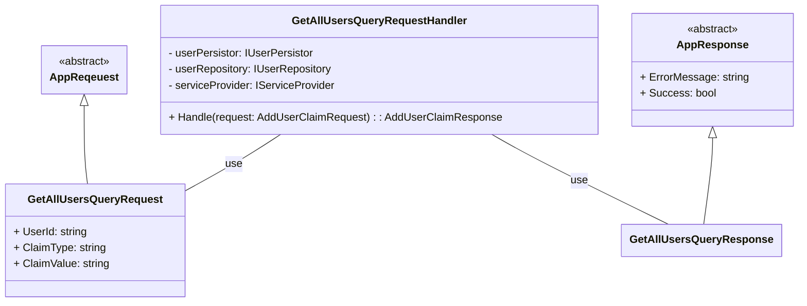

# Application.Service.GetAllUsersQueryRequestHandler

```mermaid

flowchart TB 

    start_overall((start))

    subgraph mainprocess[Application.Service.GetAllUsersQueryRequestHandler]
        direction TB            

        subgraph subprocess0["[Domain]IUserRepository.GetAllUsers"]
            direction TB            
            FindAllUser["Find All ***User***(s)"]
        end

        return["return GetAllUsersQueryResponse"]
    end

    end_overall(end)    

    %%{Class Relationship}%%
    start_overall --> FindAllUser -->
    return --> end_overall

    %% Custom Styles
    style mainprocess stroke-dasharray: 5 5;
    style subprocess0 stroke-dasharray: 5 5;

```

---

```mermaid
---
config:
    class:
        hideEmptyMembersBox: true
---

classDiagram
    %%{Class Definition}%%

    class AppReqeuest {
        <<abstract>>
    }

    class AppResponse {
        <<abstract>>
        + ErrorMessage: string
        + Success: bool
    }

    class GetAllUsersQueryRequestHandler {
        - userPersistor: IUserPersistor
        - userRepository: IUserRepository
        - serviceProvider: IServiceProvider
        + Handle(request: AddUserClaimRequest): AddUserClaimResponse
    }

    class GetAllUsersQueryRequest { 
        + UserId: string
        + ClaimType: string
        + ClaimValue: string
    }

    class GetAllUsersQueryResponse {
    }

    %%{Class Relationship}%%
    GetAllUsersQueryRequestHandler --  GetAllUsersQueryRequest : use
    GetAllUsersQueryRequestHandler --  GetAllUsersQueryResponse : use
    AppReqeuest <|-- GetAllUsersQueryRequest
    AppResponse <|-- GetAllUsersQueryResponse

```
