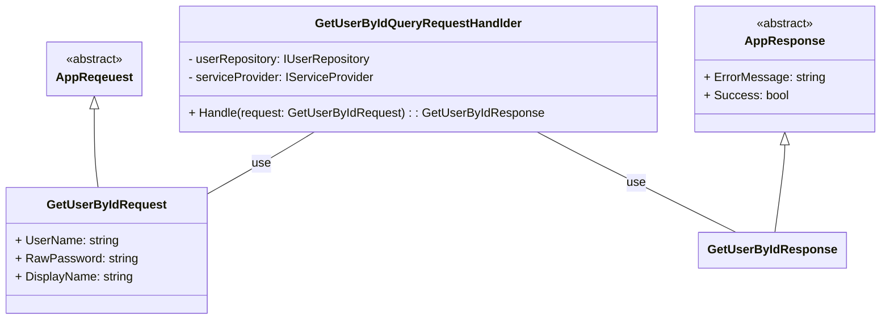

# Application.Service.AuthenticateCommandHandler

```mermaid
   


```

---

```mermaid
---
config:
    class:
        hideEmptyMembersBox: true
---

classDiagram
    %%{Class Definition}%%

    class AppReqeuest {
        <<abstract>>
    }

    class AppResponse {
        <<abstract>>
        + ErrorMessage: string
        + Success: bool
    }

    class GetUserByIdQueryRequestHandlder {
        - userRepository: IUserRepository
        - serviceProvider: IServiceProvider
        + Handle(request: GetUserByIdRequest): GetUserByIdResponse
    }

    class GetUserByIdRequest { 
        + UserName: string
        + RawPassword: string
        + DisplayName: string
    }

    class GetUserByIdResponse {
    }

    %%{Class Relationship}%%
    GetUserByIdQueryRequestHandlder --  GetUserByIdRequest : use
    GetUserByIdQueryRequestHandlder --  GetUserByIdResponse : use
    AppReqeuest <|-- GetUserByIdRequest
    AppResponse <|-- GetUserByIdResponse

```