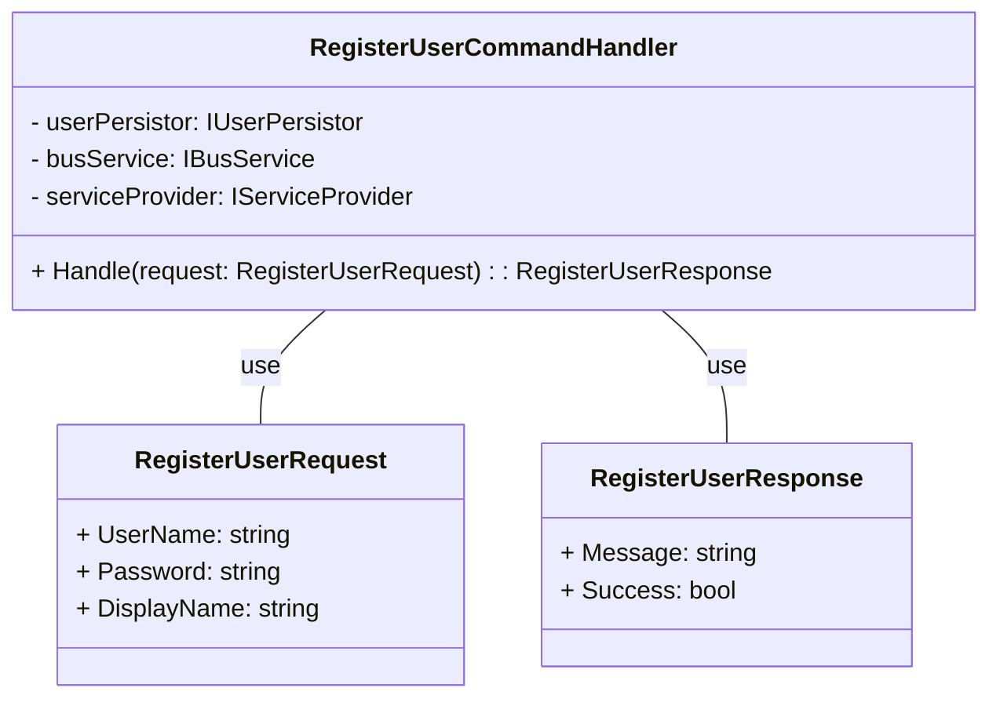

# Application.Service.RegisterUserCommandHandler

```mermaid
---
config:
    class:
        hideEmptyMembersBox: true
---

classDiagram
    %%{Class Definition}%%
    class RegisterUserCommandHandler {
        - userPersistor: IUserPersistor
        - busService: IBusService
        - serviceProvider: IServiceProvider
        + Handle(request: RegisterUserRequest): RegisterUserResponse
    }

    class RegisterUserRequest { 
        + UserName: string
        + Password: string
        + DisplayName: string
    }

    class RegisterUserResponse {
        + Message: string
        + Success: bool
    }

    %%{Class Relationship}%%
    RegisterUserCommandHandler --  RegisterUserRequest : use
    RegisterUserCommandHandler --  RegisterUserResponse : use

```