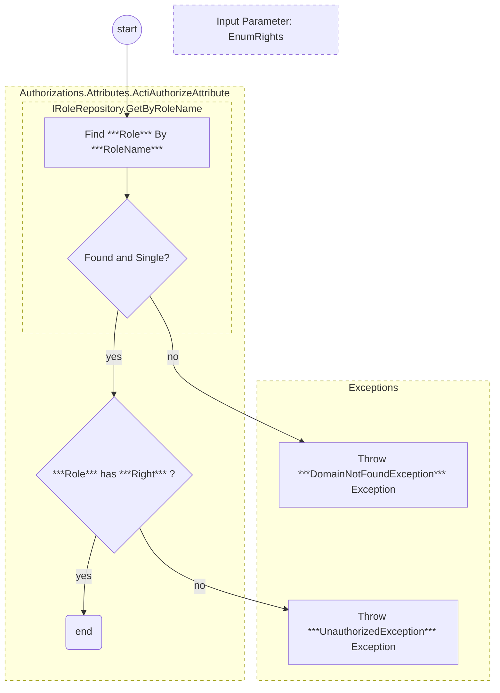

# Application.Services.Authorizations.Attributes.ActiAuthorizeAttribute

```mermaid
flowchart TB 

    subgraph mainExceptions [<div style='display:flex; justify-content:flex-start; align-items:flex-start;'>Exceptions</div>]
        direction TB
        roleNotFound["Throw ***DomainNotFoundException*** Exception"] ~~~
        DuplicatedClaim["Throw ***UnauthorizedException*** Exception"] 
    end

    start_overall((start))

    subgraph mainprocess[Authorizations.Attributes.ActiAuthorizeAttribute]
        direction TB            

        subgraph subprocess0 [IRoleRepository.GetByRoleName]
            direction TB
            
            FindUser["Find ***Role*** By ***RoleName***"] -->
            check1{Found and Single?} 
        end

        roleFound{"***Role*** has ***Right*** ?"}
        roleFound --"yes"--> end_overall
    end    
    
    end_overall(end)

    parameters["Input Parameter: EnumRights"]   

    %%{Class Relationship}%%
    start_overall --> FindUser
    check1 --"yes"--> roleFound

    check1 --"no"--> roleNotFound
    roleFound --"no"--> DuplicatedClaim
    
    %% Custom Styles
    style mainprocess stroke-dasharray: 5 5;
    style mainExceptions stroke-dasharray: 5 5;
    style subprocess0 stroke-dasharray: 5 5;
    style parameters stroke-dasharray: 5 5;

```
