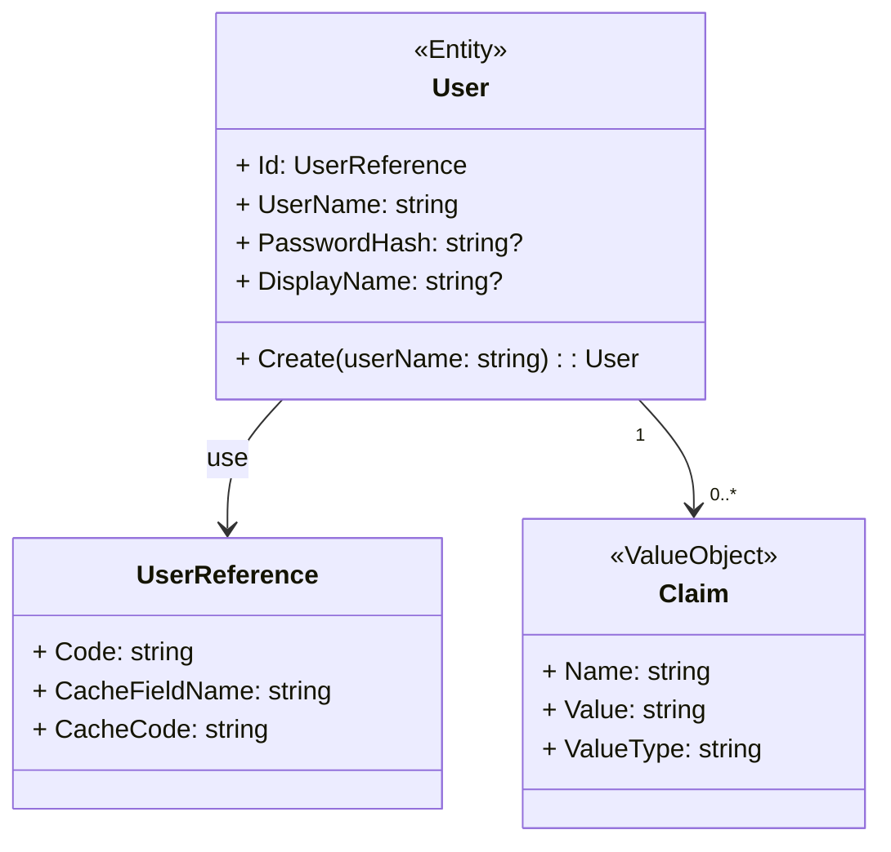

# Domain - User

```mermaid
---
config:
    class:
        hideEmptyMembersBox: true
---


classDiagram

User --> UserReference : use
User "1" --> "0..*" Claim

class User:::Entity {
    <<Entity>>
    + Id: UserReference
    + UserName: string
    + PasswordHash: string?
    + DisplayName: string?
    + Create(userName: string): User
}

class UserReference:::ValueObject {
    + Code: string
    + CacheFieldName: string
    + CacheCode: string
}

class Claim:::Interface {
    <<ValueObject>>
    + Name: string
    + Value: string
    + ValueType: string
}

```
