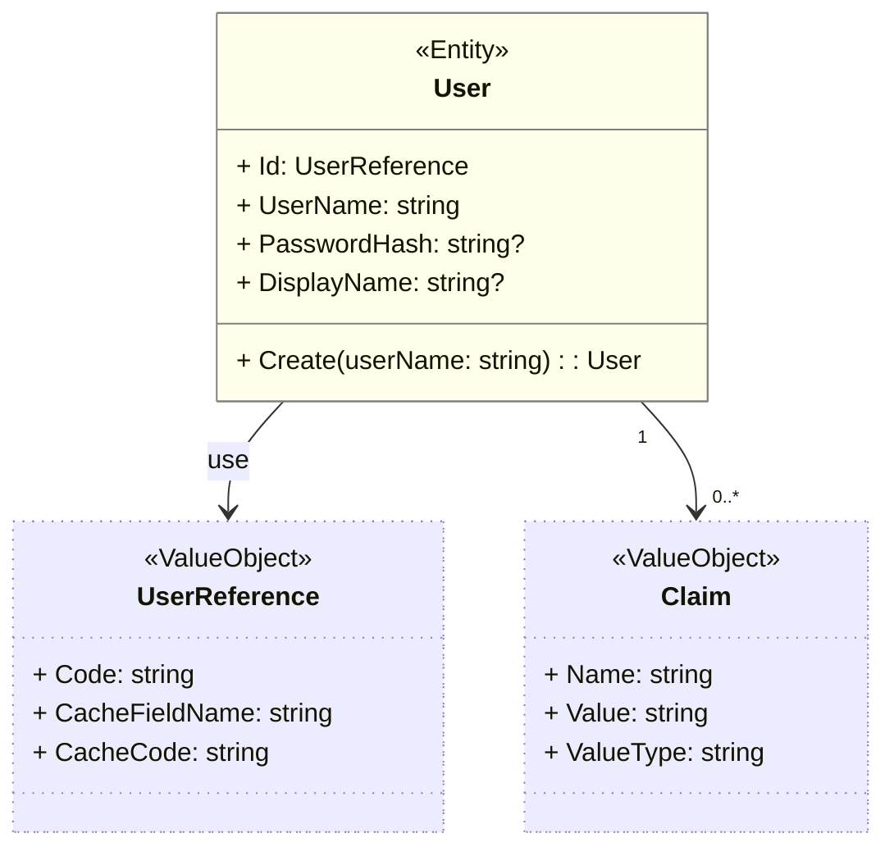

# Domain - User

```mermaid
---
config:
    class:
        hideEmptyMembersBox: true
---


classDiagram

User --> UserReference : use
User "1" --> "0..*" Claim

class User:::Entity {
    <<Entity>>
    + Id: UserReference
    + UserName: string
    + PasswordHash: string?
    + DisplayName: string?
    + Create(userName: string): User
}

class UserReference:::ValueObject {
    <<ValueObject>>
    + Code: string
    + CacheFieldName: string
    + CacheCode: string
}

class Claim:::ValueObject {
    <<ValueObject>>
    + Name: string
    + Value: string
    + ValueType: string
}

%%{Format}%%
classDef Entity: stroke-width: 1px, stroke-dasharray: none, stroke: #808080ff, fill: #ffffeaff, color: #00000000;

classDef ValueObject: stroke-width: 1px, stroke-dasharray: 1 5

classDef Interface: stroke-width: 1px, stroke-dasharray: 1 5, fill: #dfdfdfff, color: #00000000;

```
