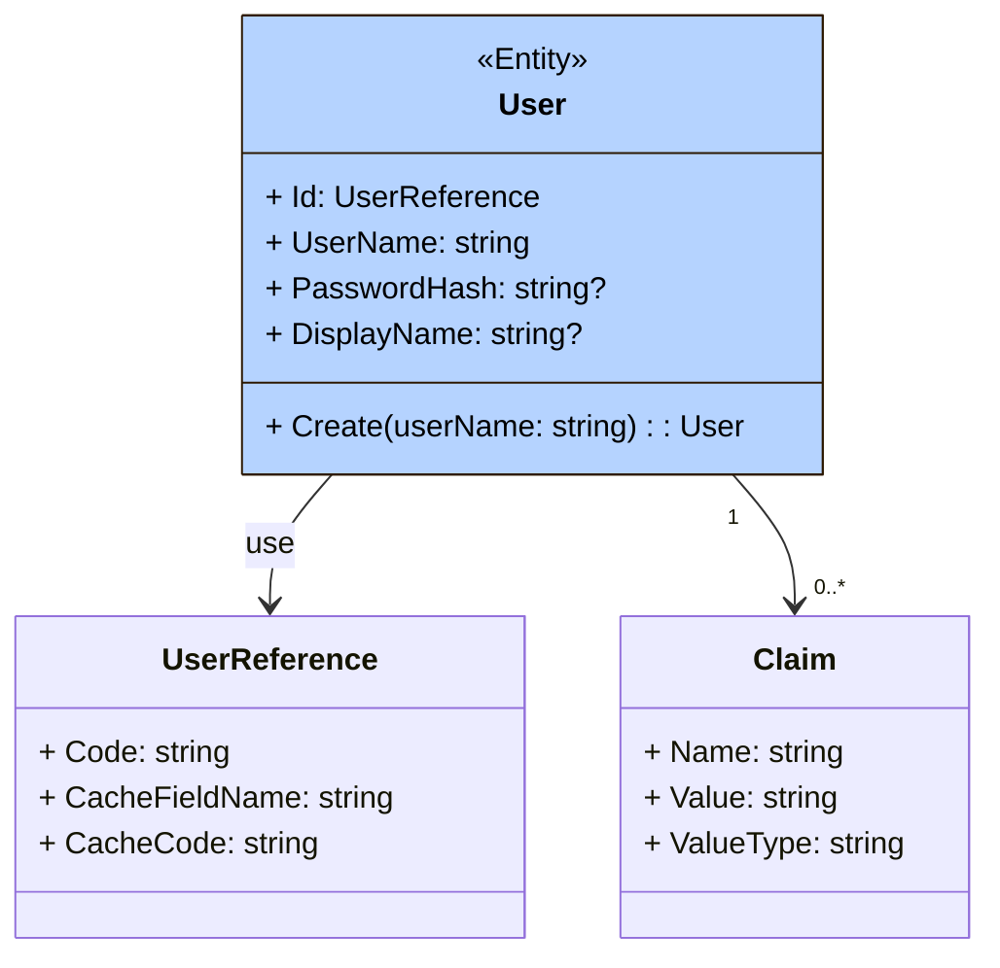

# Domain - User

```mermaid
---
config:
    class:
        hideEmptyMembersBox: true
---


classDiagram

User --> UserReference : use
User "1" --> "0..*" Claim

class User:::Entity {
    <<Entity>>
    + Id: UserReference
    + UserName: string
    + PasswordHash: string?
    + DisplayName: string?
    + Create(userName: string): User
}

class UserReference {
    + Code: string
    + CacheFieldName: string
    + CacheCode: string
}

class Claim {
    + Name: string
    + Value: string
    + ValueType: string
}

%%{Format}%%
classDef Entity: stroke-width:1px, stroke-dasharray:none,stroke:#2c1800ff, fill:#b5d3ff, color:#000000;

```
