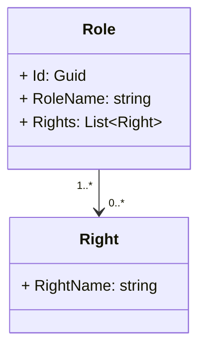

# Domain - Role

```mermaid
---
config:
    class:
        hideEmptyMembersBox: true
---

classDiagram
    class Role {
        + Id: Guid
        + RoleName: string
        + Rights: List~Right~
    }

    class Right {
        + RightName: string
    }

    %%{{Relationship}}%%
    Role "1..*"--> "0..*" Right
```
