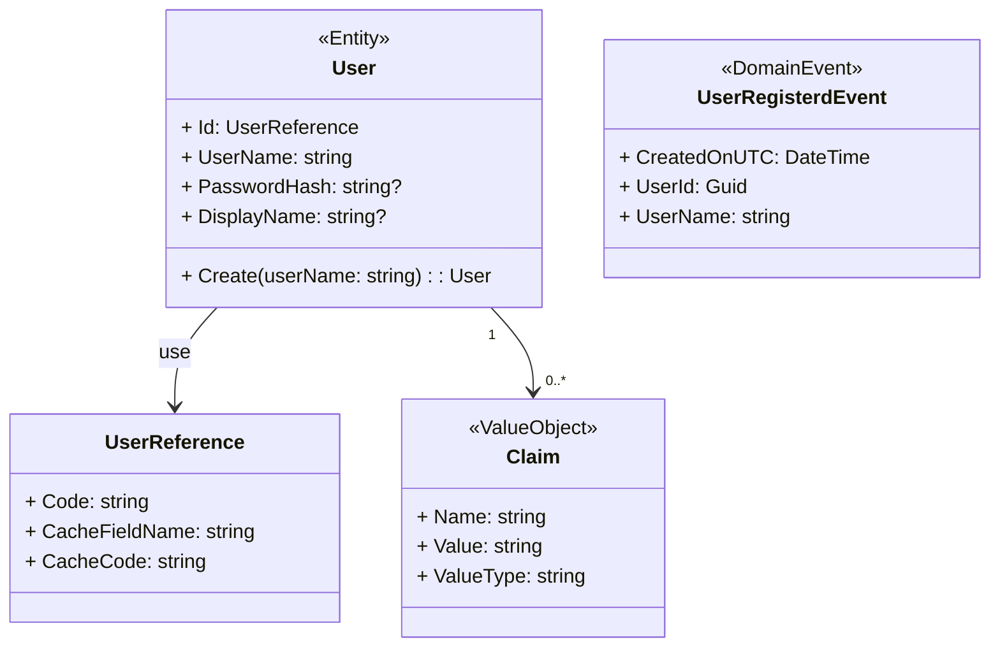

# Domain - User

```mermaid
---
config:
    class:
        hideEmptyMembersBox: true
---

classDiagram
    class User:::Entity {
        <<Entity>>
        + Id: UserReference
        + UserName: string
        + PasswordHash: string?
        + DisplayName: string?
        + Create(userName: string): User
    }

    class UserReference:::ValueObject {
        + Code: string
        + CacheFieldName: string
        + CacheCode: string
    }

    class Claim:::Interface {
        <<ValueObject>>
        + Name: string
        + Value: string
        + ValueType: string
    }

    class UserRegisterdEvent {
        <<DomainEvent>>
        + CreatedOnUTC: DateTime
        + UserId: Guid
        + UserName: string
    }

    %%{{Relationship}}%%
    User --> UserReference : use
    User "1" --> "0..*" Claim

```
